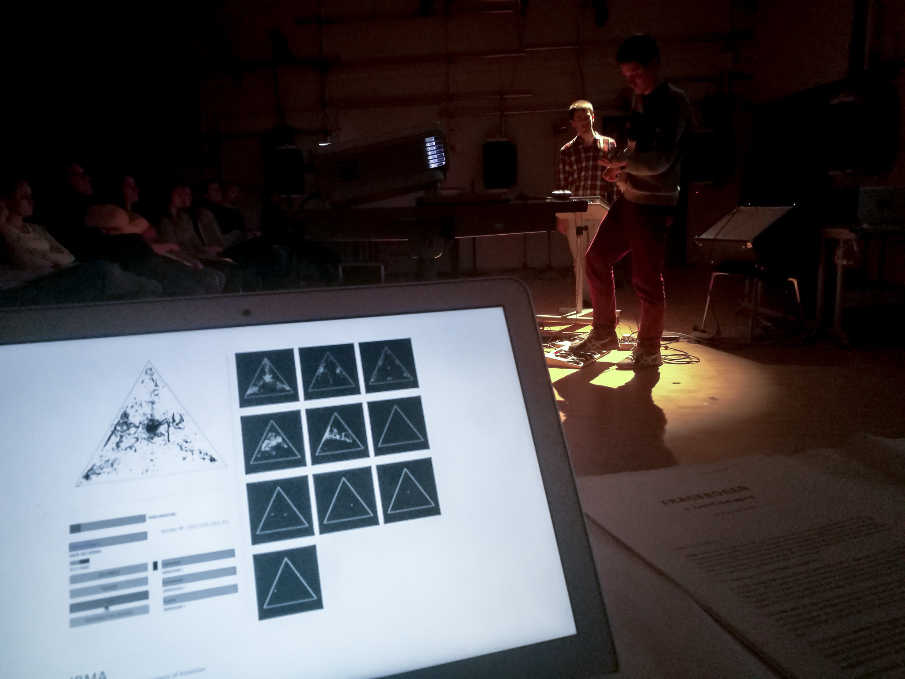

## Module IRMA Host 

The host application is executed on a computer that acts as a server. It allows the data received by the interfaces to be recorded and enables researchers to set up the experiment and to control and monitor its execution. The host application was developed in Java, utilizing the Processing library, which is widely used in the context of art.

The host module was developed in Processing 3: https://processing.org

### Dependecies:

controlP5: https://github.com/sojamo/controlp5

oscP5: https://github.com/sojamo/oscp5

IRMA host was used during the laboratory concerts of the GAPPP project. It allowed to configure the interface devices and monitor incoming data. 

Test run at the IEM (Institute for Electronic Music and Acoustics) Graz.    