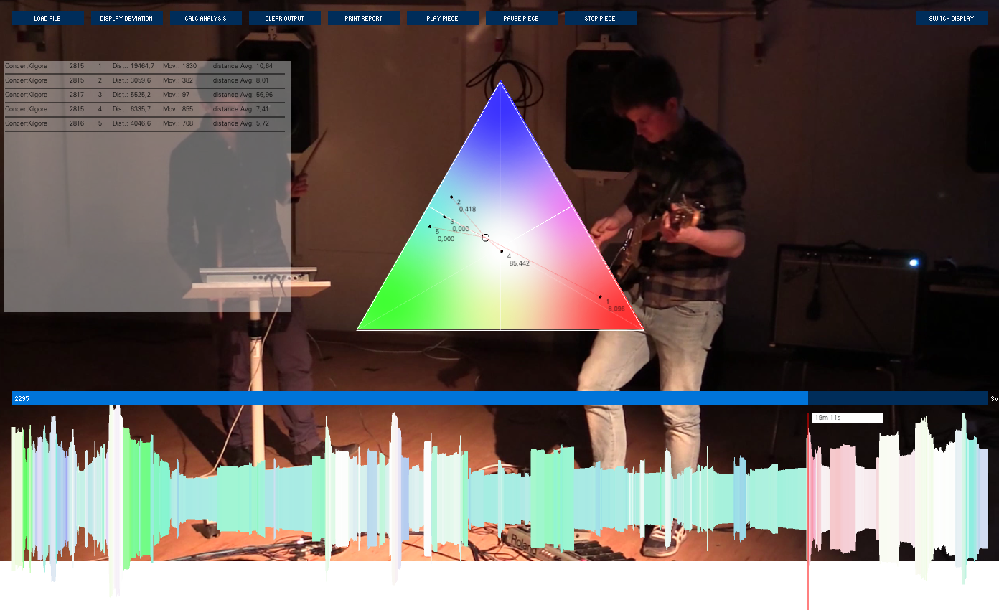
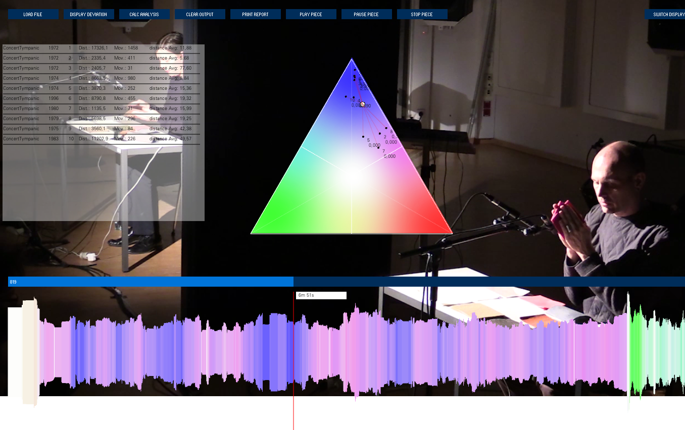
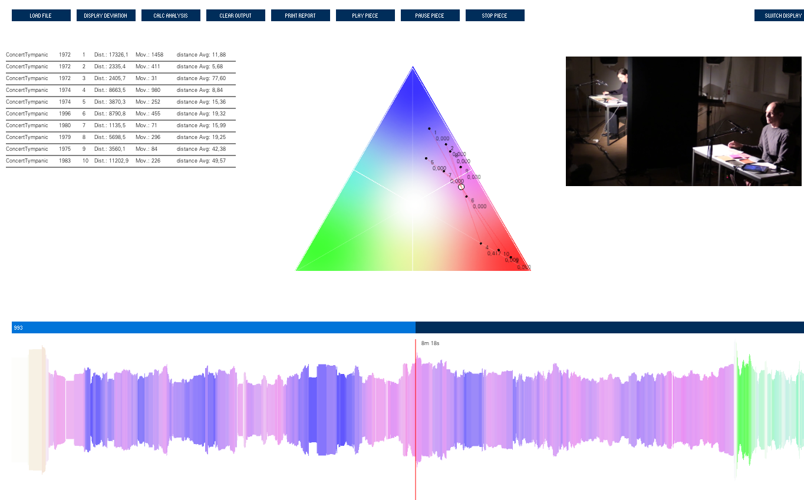
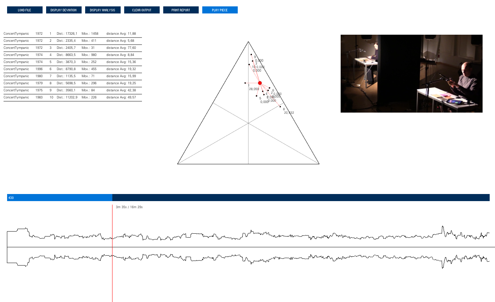

## Module IRMA Analysis v0.9

The third module of the IRMA system was designed to import the data sets collected in the lab concerts for analysis and to perform calculations as well as visualizations with them. This analysis software supports researchers in analyzing the experimentally generated traces, processing them into data, and comparing them with other data layers collected in the lab concerts.
The aim was to relate the time-related data to the events of the performances by combining qualitative, quantitative, and descriptive data levels. The software's graphical user interface allows videos to be loaded, calculations to be performed on the collected data, the results to be processed into appropriate representations, and the visualizations to be exported. As a tool, it was helpful in combining the recorded self-reports with qualitative data and video recordings.

Advanced version (v0.9) of the IRMA system's data analysis application. 
Replaces the first version of the IRMA system's data analysis application (v0.8) that was developed in Processing.

After the GAPPP project ended, IRMA was further developed to what became the [MEDIS](https://github.com/asa-nerd/MEDISanalysis) apparatus.

### Dependecies:

Version 0.9 developed in IntelliJ, compiles with Liberica JDK 17.0.4 V2 : https://bell-sw.com/libericajdk/

JavaFX (which is part of the JDK if Liberica is used): https://openjfx.io

json-simple: https://github.com/fangyidong/json-simple

javaGeom: https://sourceforge.net/projects/geom-java/files/

### GUI

