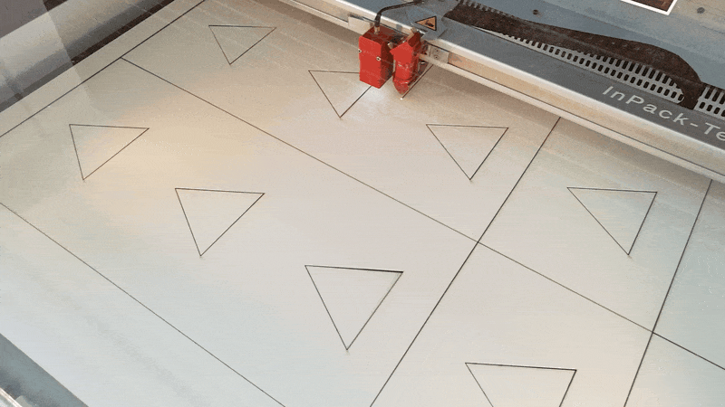

### Enclosure for the IRMA interfaces 

The hardware used for IRMA's interfaces consisted of touch tablets built into specially designed enclosures. These enclosures were initially developed to compensate for the different physical characteristics of various device types and to create identical external conditions of use for the test subjects. The enclosures standardized the size, feel, and appearance of the interfaces and ensured uniform use.

A second advantage of the casings was that the cut-out for the attention triangle provided haptic feedback to the participants during operation. This allowed them to feel the boundaries of the input field with their fingers without having to look at the interface. The size of the cut-out was determined by the height of the usable display area of the smaller tablets. The housings were designed for production from sturdy cardboard, which was cut to size using a laser cutting process. Ten interface devices were manufactured for use in the GAPPP laboratory concerts. The tablets were equipped with a specially developed Android app for use as an interface for the measuring equipment.

