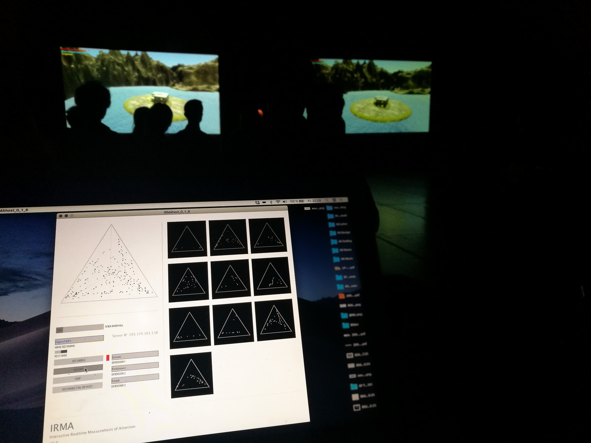
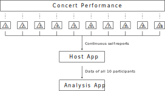

# IRMA repositories

This project includes software, plans, documentation, and experimental data related to the measuring apparatus IRMA (Interactive Real-time Measurement of Attention). The system was developed for the laboratory concerts ob the GAPPP (Gamified Audiovisual Performance
and Performance Practice) project and was used to record and analyze audience responses. [GAPPP](http://gappp.net) was a research project (led by Marko Ciciliani) at the University of Music and Performing Arts Graz/Austria from 2017 to 2021. 
The application of the IRMA apparatus, results of the research and implications are discussed in depth in the book "The Apparatus is Present – Zur Verbindung von Experiment und Konzert in der Musikforschung" (Andreas Pirchner), that was published by [transcript Verlag](https://www.transcript-verlag.de/978-3-8376-7837-6/the-apparatus-is-present-zur-verbindung-von-experiment-und-konzert-in-der-musikforschung/ "transcript Verlag") in 2025.

#### Modules

IRMA combines consumer hardware (tablets with touch displays) with custom-developed open-source software. The measurement apparatus is designed in three modules, which are schematically illustrated in the figure below. To provide continuous self-reports, audience members operated interface devices during the performances. These were connected via local Wi-Fi to a server application on a host computer. This host was used for receiving and recording the collected measurement data as well as for configuring and controlling the experiment. The third module consisted of software that was developed for the subsequent analysis of the collected data.

Each module has its own repository on Github. 

#### 1 IRMA Interface

Code and documentation of IRMA's interface devices.  

#### 2 IRMA Host

Contains documentation of the host app that is executed on a computer acting as a server. IRMA Host allows the data received by the interfaces to be recorded and enables researchers to set up the experiment and to control and monitor its execution.

#### 3 IRMA Analysis

Provides documentation of the analysis app which was designed to import the data sets collected in the lab concerts for analysis and to perform calculations as well as visualizations with them.

#### 4 IRMA Enclosure and Plans

Documentation and plans for the enclosures of the IRMA handheld devices. The enclosures standardized the size, feel, and appearance of the interfaces and ensured uniform use.

#### 5 Raw Data

A repository providing the data collected with IRMA during the laboratory concerts of the GAPPP project. 
